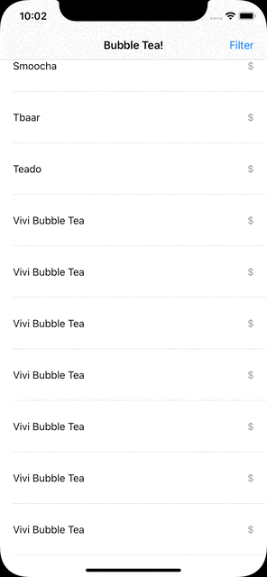
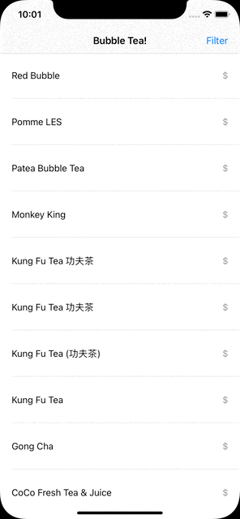

# BGBubbleTea
This is Core Data app which based on concept ```NSPredicate``` & ```NSSortDescriptor``` of Core Data to filter and sort out query data into it. ```seed.json``` file is used as source of data into this for creating a Dummy Data into Core Data into this

## App Preview
<kbd>

</kbd>
 &nbsp; &nbsp; &nbsp; &nbsp;
 <kbd>

</kbd>


#### NSPredicate used for filtering Tea Cafes

```
lazy var cheapVenuePredicate: NSPredicate = {
  return NSPredicate(format: "%K=%@", #keyPath(Venue.priceInfo.priceCategory), "$")
}()

lazy var moderateVenuePredicate: NSPredicate = {
  return NSPredicate(format: "%K=%@", #keyPath(Venue.priceInfo.priceCategory), "$$")
}()

lazy var expensiveVenuePredicate: NSPredicate = {
  return NSPredicate(format: "%K=%@", #keyPath(Venue.priceInfo.priceCategory), "$$$")
}()

lazy var offeringDealPredicate: NSPredicate = {
  return NSPredicate(format: "%K > 0", #keyPath(Venue.specialCount))
}()

lazy var walkingDistancePredicate: NSPredicate = {
  return NSPredicate(format: "%K < 1000", #keyPath(Venue.location.distance))
}()

lazy var hasUserTipPredicate: NSPredicate = {
  return NSPredicate(format: "%K > 0", #keyPath(Venue.stats.tipCount))
}()
```

#### NSSortDescriptor used for sorting Tea Cafes

```
lazy var nameSortDescriptor: NSSortDescriptor = {
    let compareSelector = #selector(NSString.localizedStandardCompare(_:))
    return NSSortDescriptor(key: #keyPath(Venue.name), ascending: true, selector: compareSelector)
}()

lazy var distanceSortDescriptor: NSSortDescriptor = {
    return NSSortDescriptor(key: #keyPath(Venue.location.distance), ascending: true)
}()

lazy var priceSortDescriptor: NSSortDescriptor = {
    return NSSortDescriptor(key: #keyPath(Venue.priceInfo.priceCategory), ascending: true)
}()
```

